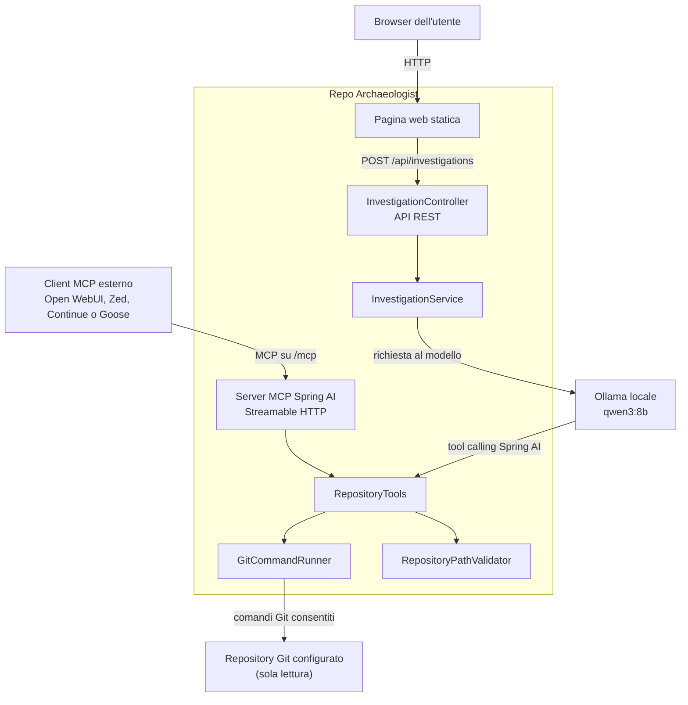
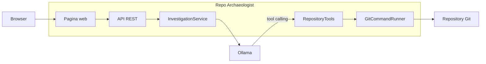
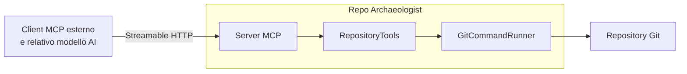
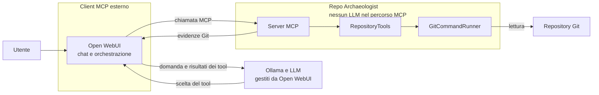

# Repo Archaeologist

Repo Archaeologist è un assistente locale e open source che aiuta a rispondere a una domanda spesso difficile nei progetti software:

> Perché questo codice esiste e quali evidenze storiche lo dimostrano?

L'applicazione analizza in sola lettura la cronologia di un repository Git, affida il ragionamento a un modello eseguito localmente con Ollama e rende gli stessi strumenti disponibili tramite REST e Model Context Protocol (MCP).

Il progetto non si limita a riassumere il codice corrente. Interroga commit, patch, rinomine e `git blame`, separando nella risposta:

- fatti direttamente verificabili;
- inferenze plausibili;
- informazioni che la cronologia non permette di stabilire.

## Stato del progetto

La versione `0.1.1` è un MVP funzionante. Può:

- descrivere repository, branch, stato e commit recenti;
- ricostruire la storia di un file seguendone le rinomine;
- attribuire intervalli di righe ai commit di origine;
- cercare un termine nei messaggi e nelle modifiche storiche;
- mostrare metadati e patch di un commit;
- combinare autonomamente questi strumenti tramite Spring AI e Ollama;
- esporre gli strumenti a client MCP tramite Streamable HTTP.

## Esempi di domande

- Perché è stata introdotta questa validazione?
- Quale commit ha aggiunto questa dipendenza e con quale motivazione?
- Questo workaround sembra ancora necessario?
- Quando è cambiato il comportamento di questa classe?
- Quali test documentano questa scelta?
- La documentazione attuale è coerente con l'evoluzione del codice?

## Architettura

Repo Archaeologist offre due percorsi alternativi che condividono gli stessi
strumenti Git:



### Percorso web: REST e Ollama

La pagina disponibile su `http://localhost:8080` non usa MCP. Invia la domanda
all'API REST; `InvestigationService` la passa al modello Ollama configurato, che
decide quali operazioni di `RepositoryTools` chiamare. Il modello riceve le
evidenze Git e formula la risposta mostrata nella pagina.



In questo percorso Repo Archaeologist è un'applicazione AI completa: fornisce
interfaccia, coordinamento del modello e strumenti Git.

### Percorso MCP: strumenti per un assistente esterno

MCP, Model Context Protocol, è uno standard che permette a un'applicazione AI di
scoprire e usare strumenti offerti da un altro processo. Un client MCP esterno può
essere, per esempio, Open WebUI, Zed, Continue o Goose.



Il client esterno gestisce la conversazione e il proprio modello. Repo
Archaeologist agisce invece come server specializzato: descrive i tool
disponibili, ne valida i parametri, esegue operazioni Git in sola lettura e
restituisce le evidenze. Il client decide quali tool chiamare e costruisce la
risposta finale.

In questo percorso Repo Archaeologist non esegue un LLM e non chiama Ollama.
`InvestigationController`, `InvestigationService` e il `ChatClient` configurato
per Ollama appartengono esclusivamente al percorso web REST e non partecipano
alle richieste MCP.

Il client MCP può comunque scegliere lo stesso Ollama locale e lo stesso modello
`qwen3:8b`. In tal caso è il client, per esempio Open WebUI, a comunicare con
Ollama:

```text
Pagina nativa: Repo Archaeologist -> Ollama
Percorso MCP:  Open WebUI -> Ollama
               Open WebUI -> MCP -> Repo Archaeologist
```

`RepositoryTools` è quindi il nucleo condiviso dell'applicazione. Ogni operazione
è annotata sia come tool Spring AI per Ollama sia come tool MCP, evitando di
duplicare logica e regole di sicurezza.

### Componenti principali

| Componente | Responsabilità |
|---|---|
| `InvestigationController` | Espone l'API REST per le domande in linguaggio naturale |
| `InvestigationService` | Coordina modello locale e tool calling |
| `RepositoryTools` | Definisce le operazioni archeologiche disponibili |
| `GitCommandRunner` | Esegue comandi Git consentiti senza utilizzare una shell |
| `RepositoryPathValidator` | Blocca path traversal e file esterni al repository |
| Server MCP Spring AI | Pubblica `RepositoryTools` ai client esterni tramite Streamable HTTP |

## Stack tecnologico

- Eclipse Temurin OpenJDK 25 LTS;
- Spring Boot 4.1.0;
- Spring AI 2.0.0;
- Spring AI MCP Server;
- Ollama;
- Maven Wrapper 3.9.11;
- JUnit 5 e AssertJ.

## Requisiti

- macOS, Linux o Windows con Git disponibile nel `PATH`;
- SDKMAN consigliato su macOS/Linux;
- Ollama avviato localmente;
- almeno un modello Ollama con supporto adeguato al tool calling;
- il repository da analizzare già clonato sul computer.

Il progetto non richiede IntelliJ IDEA Ultimate: IntelliJ IDEA Community Edition è sufficiente.

## Installazione di Java con SDKMAN

```bash
sdk install java 25.0.3-tem
```

Entrando nella directory del progetto:

```bash
sdk env
java -version
```

La configurazione è dichiarata in `.sdkmanrc` e non dipende dal JDK selezionato globalmente.

## Preparazione di Ollama

Il modello predefinito è `qwen3:8b`:

```bash
ollama pull qwen3:8b
ollama serve
```

È possibile usare un altro modello tramite `OLLAMA_MODEL`, purché supporti correttamente il tool calling.

## Avvio

Indicare sempre il repository che si vuole analizzare:

```bash
export ARCHAEOLOGIST_REPOSITORY=/percorso/assoluto/al/repository
./mvnw spring-boot:run
```

L'applicazione ascolta per impostazione predefinita su `http://localhost:8080`.

Aprendo lo stesso indirizzo nel browser è disponibile una demo web locale, senza
dipendenze frontend aggiuntive. La pagina usa l'API REST dell'applicazione e mostra
alcune domande di esempio per presentare rapidamente il flusso di investigazione.

### Esecuzione rapida della demo su macOS

La demo richiede due terminali. Nel primo avviare Ollama e, solo al primo utilizzo,
scaricare il modello configurato:

```bash
ollama pull qwen3:8b
ollama serve
```

Se l'applicazione Ollama è già attiva nella barra dei menu, `ollama serve` non è
necessario. È possibile verificare i modelli installati con:

```bash
ollama list
```

Nel secondo terminale entrare nella directory di Repo Archaeologist, attivare il
JDK dichiarato dal progetto e indicare il repository Git da analizzare:

```bash
cd /percorso/assoluto/repo-archaeologist
sdk env
export ARCHAEOLOGIST_REPOSITORY=/percorso/assoluto/al/repository-da-analizzare
./mvnw spring-boot:run
```

Il percorso assegnato ad `ARCHAEOLOGIST_REPOSITORY` deve essere la radice di una
working tree Git. Per provare l'applicazione su sé stessa:

```bash
export ARCHAEOLOGIST_REPOSITORY="$(pwd)"
./mvnw spring-boot:run
```

Quando nei log compare `Started RepoArchaeologistApplication`, aprire:

```text
http://localhost:8080
```

Una prima risposta può richiedere più tempo perché Ollama deve caricare il modello
in memoria. Per una verifica rapida si può chiedere:

> Qual è lo scopo di questo repository? Cita un commit come evidenza.

Per arrestare l'applicazione premere `Ctrl+C` nel terminale Spring Boot. Fare lo
stesso nel terminale Ollama se il server è stato avviato manualmente.

### Avvio da IntelliJ IDEA Community Edition

1. Aprire la directory del progetto.
2. Importare il progetto Maven quando richiesto.
3. Selezionare Temurin 25 come Project SDK.
4. Creare una configurazione per `RepoArchaeologistApplication`.
5. Aggiungere `ARCHAEOLOGIST_REPOSITORY` e, se necessario, `OLLAMA_MODEL` alle variabili d'ambiente.
6. Avviare la configurazione.

## Uso tramite API REST

```bash
curl --request POST http://localhost:8080/api/investigations \
  --header 'Content-Type: application/json' \
  --data '{"question":"Perché è stato modificato il controllo degli input?"}'
```

Risposta:

```json
{
  "question": "Perché è stato modificato il controllo degli input?",
  "answer": "...risposta con commit ed evidenze...",
  "generatedAt": "2026-07-16T08:00:00Z"
}
```

## Uso come server MCP

Il server MCP usa Streamable HTTP ed è disponibile all'endpoint:

```text
http://localhost:8080/mcp
```

Esempio concettuale di configurazione di un client MCP:

```json
{
  "mcpServers": {
    "repo-archaeologist": {
      "type": "streamable-http",
      "url": "http://localhost:8080/mcp"
    }
  }
}
```

Quando si collega, il client riceve il catalogo dei tool con nome, descrizione,
parametri e tipi. Non riceve accesso libero alla shell o a Git.

### Tool MCP disponibili

#### `repositoryOverview`

```text
repositoryOverview()
```

Non richiede parametri. Restituisce percorso e radice del repository, branch
corrente, stato della working tree e ultimi dieci commit.

Esempio di domanda:

> Fammi una panoramica del repository e degli ultimi cambiamenti.

#### `fileHistory`

```text
fileHistory(filePath: "src/main/java/com/example/service/OrderService.java")
```

Riceve il percorso relativo di un file e ne restituisce fino a dodici commit con
metadati e patch, seguendo anche eventuali rinomine.

Esempio di domanda:

> Come si è evoluto `OrderService.java` e perché è cambiato?

#### `blameLines`

```text
blameLines(
  filePath: "src/main/java/com/example/service/OrderService.java",
  startLine: 40,
  endLine: 65
)
```

Attribuisce le righe richieste ai commit che le hanno introdotte. L'intervallo è
inclusivo, parte da 1 e non può superare 300 righe.

Esempio di domanda:

> Quali commit hanno introdotto la validazione tra le righe 40 e 65?

#### `searchHistory`

```text
searchHistory(query: "fiscalCode")
```

Cerca un testo letterale sia nei messaggi dei commit sia nel contenuto aggiunto o
rimosso dalle patch. La ricerca deve contenere da 1 a 120 caratteri.

Esempio di domanda:

> Quando è comparso per la prima volta `fiscalCode`?

#### `inspectCommit`

```text
inspectCommit(commit: "a84f12c")
```

Riceve un hash Git completo o abbreviato e restituisce metadati, statistiche e
patch del commit.

Esempio di domanda:

> Esamina il commit `a84f12c` e spiegami cosa ha cambiato.

### Esempio di flusso con Open WebUI

Alla domanda:

> Perché è stato introdotto il controllo sul codice fiscale?

il modello configurato in Open WebUI potrebbe:

1. chiamare `searchHistory("codice fiscale")`;
2. cercare anche `searchHistory("fiscalCode")`;
3. approfondire il commit trovato con `inspectCommit("a84f12c")`;
4. consultare il file interessato con `fileHistory(...)`;
5. combinare le evidenze nella risposta finale.



Open WebUI gestisce quindi la chat e orchestra il modello; Ollama esegue il
modello; Repo Archaeologist riceve le chiamate MCP e restituisce evidenze Git. Il
server MCP non formula la risposta finale e non coinvolge
`InvestigationService`.

### Limiti del contratto MCP

Il server MCP:

- non modifica file, commit o branch;
- non esegue push;
- non accetta comandi shell o Git arbitrari;
- non legge file esterni al repository configurato;
- non permette di cambiare repository durante una richiesta;
- non interroga automaticamente issue e pull request remote.

Il repository è fissato all'avvio tramite `ARCHAEOLOGIST_REPOSITORY`; tutti i
client collegati lavorano su quella stessa working tree. Il formato esatto della
configurazione dipende dal client MCP utilizzato.

## Configurazione

| Variabile | Predefinito | Significato |
|---|---|---|
| `ARCHAEOLOGIST_REPOSITORY` | `.` | Repository Git analizzato |
| `OLLAMA_BASE_URL` | `http://localhost:11434` | Endpoint Ollama |
| `OLLAMA_MODEL` | `qwen3:8b` | Modello locale |
| `SERVER_PORT` | `8080` | Porta HTTP |
| `GIT_COMMAND_TIMEOUT_SECONDS` | `10` | Timeout di ogni comando Git |
| `GIT_MAX_OUTPUT_CHARACTERS` | `30000` | Dimensione massima restituita da un tool |

## Sicurezza e privacy

Repo Archaeologist è progettato per lavorare localmente:

- non invia intenzionalmente codice a provider cloud;
- usa solo il repository indicato esplicitamente;
- non esegue comandi Git di scrittura;
- non passa gli argomenti attraverso `sh`, `bash` o altre shell;
- applica un'allowlist ai sottocomandi Git;
- impedisce l'accesso a file esterni al repository;
- limita durata e dimensione dell'output dei processi.

Il modello riceve comunque porzioni della cronologia e delle patch necessarie a rispondere. Prima di collegare un modello diverso da Ollama, verificare attentamente dove vengono elaborati i dati.

L'MVP non implementa autenticazione HTTP: esporlo solo su `localhost` o dietro un livello di sicurezza appropriato.

## Compilazione e test

```bash
./mvnw clean verify
```

I test unitari creano repository Git temporanei e verificano sia l'allowlist dei comandi sia la protezione dal path traversal. Non richiedono Ollama.

## Limiti attuali

- Analizza un repository alla volta.
- La qualità delle risposte dipende dal modello e dalla qualità dei messaggi di commit.
- Non indicizza ancora ADR, issue o pull request remote.
- Non conserva una knowledge base persistente.
- Non offre ancora streaming delle risposte REST.
- Non autentica i client MCP.

## Roadmap

- importazione e collegamento degli Architecture Decision Record;
- rilevamento automatico di test e documentazione correlati;
- timeline strutturata delle decisioni;
- supporto opzionale a issue e pull request GitHub;
- cache locale delle evidenze già analizzate;
- output strutturato con livello di confidenza;
- UI web minimale;
- autenticazione e policy per il server MCP.

## Contribuire

Issue, proposte e pull request sono benvenute. Prima di inviare una modifica:

```bash
./mvnw clean verify
```

Mantenere identificatori e nomi tecnici in inglese; documentazione e commenti possono essere in italiano. Le nuove operazioni Git devono essere strettamente in sola lettura, avere limiti espliciti e includere test.

## Licenza

Distribuito con licenza [Apache License 2.0](LICENSE).

## Autore

Gianluca Bove.
